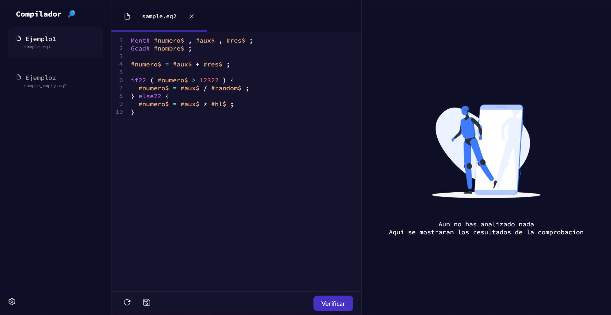
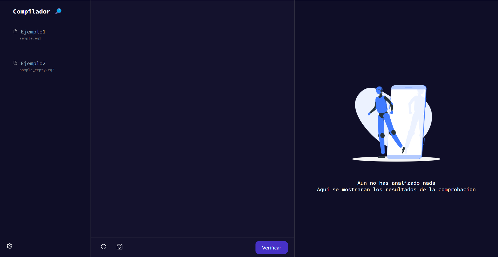
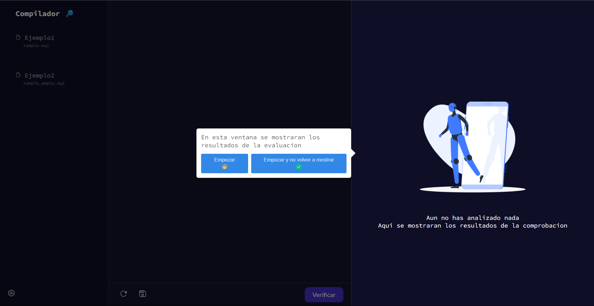
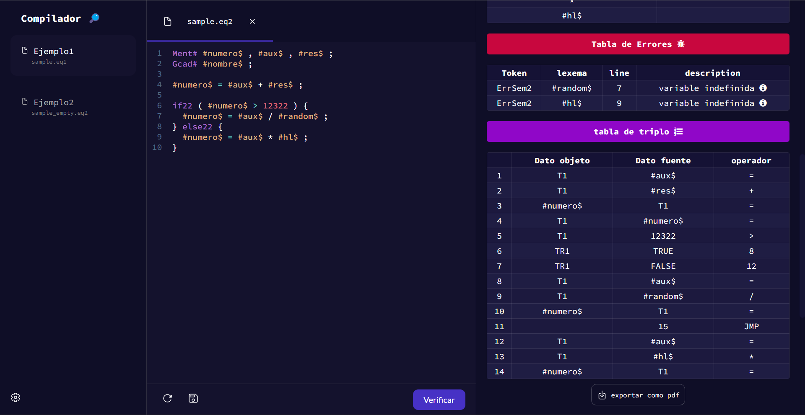

# Javascript compiler
 

## Try it out online
https://compiler-theta.vercel.app/

## Run locally
Usea local server of your preference to load the index.html file
## Screenshots

  
  
  
  

## License

[MIT](https://choosealicense.com/licenses/mit/)